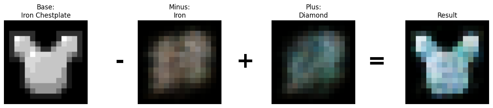
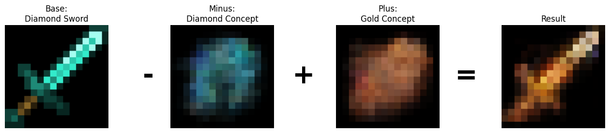

# C-VAE: Convolutional Variational Autoencoder in C

A fully functional Convolutional VAE implemented in C from scratch. I trained the VAE with minecraft item textures, which are very low dimensional (16x16), and make
this project feasable. The code is single-threaded on CPU. With a VAE trained on minecraft items you can do pretty fun stuff, like interpolating between existing minecraft items, generating new ones, and even doing arithmetic in the latent space. For the results section, I chose to do the latter.

I used the encoder to get a latent representation
for an iron chestplate, I also encoded all iron and diamond items and averaged them out to get latent vectors for the 'iron' and 'diamond' concepts. And finally, I substracted
the 'iron' concept from the iron chestplate, and added the 'diamond' concept. If the VAE was able to extract such features and learn a reasonable latent space, we should expect
an image resembling a diamond chestplate from these operations.


## Features

- **Custom Deep Learning Framework**: Implemented layers (Conv2d, ConvTranspose2d, Affine, ReLU, Sigmoid) with forward/backward passes.
- **Optimization**: Adam optimizer.
- **Architecture**:
    - Encoder: 2x Conv Layers -> 2048 units -> Latent Dim 16.
    - Decoder: Latent Dim 16 -> 2048 units -> 2x Transposed Conv Layers -> Output.
- **Latent Arithmetic**: Manipulate concepts in vector space (e.g., `Base - ConceptA + ConceptB`).

## Results

The VAE learns a structured latent space that allows for arithmetic operations on item properties.

**1. Material Transmutation: Iron to Diamond**
Taking an **Iron Chestplate**, subtracting the "Iron" concept vector, and adding the "Diamond" concept vector results in a generated **Diamond Chestplate**.

```bash
./bin/arithmetic iron_chestplate.png iron diamond
```



**2. Material Transmutation: Diamond to Gold**
Taking a **Diamond Sword**, subtracting the "Diamond" concept vector, and adding the "Gold" concept vector results in a generated **Gold Sword**.

```bash
./bin/arithmetic diamond_sword.png diamond gold
```



## Build & Usage

In this section I outline how to reproduce these results. To get the minecraft textures you can download them from the official source: https://github.com/Mojang/bedrock-samples.

### Prerequisites
- GCC
- Make
- Python 3 + `uv` (for data extraction)

### 1. Data Setup
Extract the textures from the Minecraft resource pack:
```bash
uv sync
cd pytorch_poc
uv run python extract_textures.py
cd ..
```
This creates `pytorch_poc/mc_items.bin` (binary pixel data) and `pytorch_poc/mc_items.txt` (filenames).

### 2. Training
Compile and run the training loop (default 100 epochs):
```bash
make
./bin/train_vae
```
This saves the trained model weights to `vae_weights.bin`. If weights already exist, training resumes from them.

### 3. Latent Arithmetic Demo
Perform vector arithmetic in the latent space and generate a result image:
```bash
./bin/arithmetic <base_item> <minus_concept> <plus_concept>
```
Output is saved to `base.ppm`, `minus.ppm`, `plus.ppm`, and `result.ppm`.

## Project Structure
- `src/`: Source code (`vae.c`, `layers/`, `train.c`, `arithmetic_demo.c`).
- `include/`: Header files.
- `pytorch_poc/`: Python proof-of-concept and data extraction tools.