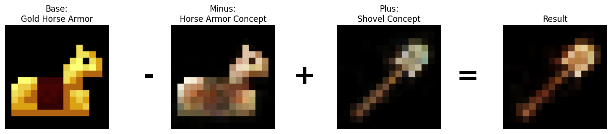

# C-VAE: Convolutional Variational Autoencoder in C

A fully functional Convolutional VAE implemented in pure C from scratch. The VAE was trained using Minecraft item textures, which are very low resolution (16x16), making this project feasible on a CPU. The code is multi-threaded using OpenMP.

With a VAE trained on Minecraft items you can do interesting experiments, like interpolating between existing items, generating new ones, and even doing arithmetic in the latent space. For the results section, I chose to do the latter.

I used the encoder to get a latent representation for an iron chestplate. Then, I encoded all iron and diamond items and computed the average to get latent vectors for the 'iron' and 'diamond' concepts. Finally, I subtracted the 'iron' concept from the iron chestplate and added the 'diamond' concept. If the VAE successfully learned the features of the latent space, we should expect an image resembling a diamond chestplate from these operations.

The pytorch_poc folder contains a PyTorch proof of concept. It implements the exact same architecture used in the C version. Additionally, this folder includes a script to convert images from PNG to a binary format, as I wanted to focus on AI/ML implementation rather than writing a PNG parser in C.


## Features

* **No External Dependencies**: Written in standard C. No Matrix libraries or ML frameworks used.
- **Custom Deep Learning Framework**: Implemented layers (Conv2d, ConvTranspose2d, Affine, ReLU, Sigmoid) with forward/backward passes.
- **CPU Multi-threaded with OpenMP**: Leveraged OpenMP to parallelize heavy computations.
- **Architecture**:
    - Encoder: 2x Conv Layers -> 2048 units -> Latent Dim 16.
    - Decoder: Latent Dim 16 -> 2048 units -> 2x Transposed Conv Layers -> Output.
- **Latent Arithmetic**: Manipulate concepts in vector space (e.g., `Base - ConceptA + ConceptB`).

## Results

The VAE learns a structured latent space that allows for arithmetic operations on item properties.

**1. Iron to Diamond**
Taking an **Iron Chestplate**, subtracting the "Iron" concept vector, and adding the "Diamond" concept vector results in a generated **Diamond Chestplate**.

```bash
./bin/arithmetic iron_chestplate.png iron diamond
```


**2. Horse armor to Tool**
Taking **Gold Horse Armor**, subtracting the "Horse Armor" concept vector, and adding the "Shovel" concept vector results in a generated **Gold Shovel**.

```bash
./bin/arithmetic gold_horse_armor.png horse_armor shovel
```



## Build & Usage

In this section I outline how to reproduce these results. To get the Minecraft textures, you can download them from the official source: https://github.com/Mojang/bedrock-samples.

### Prerequisites
- GCC
- Make
- Python 3 + `uv` (for data extraction)

### 1. Data Setup
Extract the textures from the Minecraft resource pack:
```bash
cd pytorch_poc
uv sync
uv run python extract_textures.py
```
This creates `pytorch_poc/mc_items.bin` (binary pixel data) and `pytorch_poc/mc_items.txt` (filenames).

### 2. Training
Compile and run the training loop (default 500 epochs):
```bash
make
./bin/train_vae
```
This saves the trained model weights to `vae_weights.bin`. On an i5-12400 it took 689 seconds (11 min 29 sec) to do 500 epochs. The model used for the demonstration was trained on 500 epochs.

### 3. Latent Arithmetic Demo
Perform vector arithmetic in the latent space and generate a result image:
```bash
./bin/arithmetic <base_item> <minus_concept> <plus_concept>
```
Output is saved to `base.ppm`, `minus.ppm`, `plus.ppm`, and `result.ppm`.

## Project Structure
- `src/`: Source code (`vae.c`, `layers/`, `train.c`, `arithmetic_demo.c`).
- `include/`: Header files.
- `pytorch_poc/`: Python proof-of-concept and data extraction tools.
